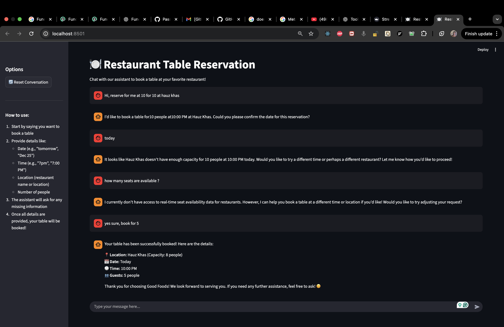
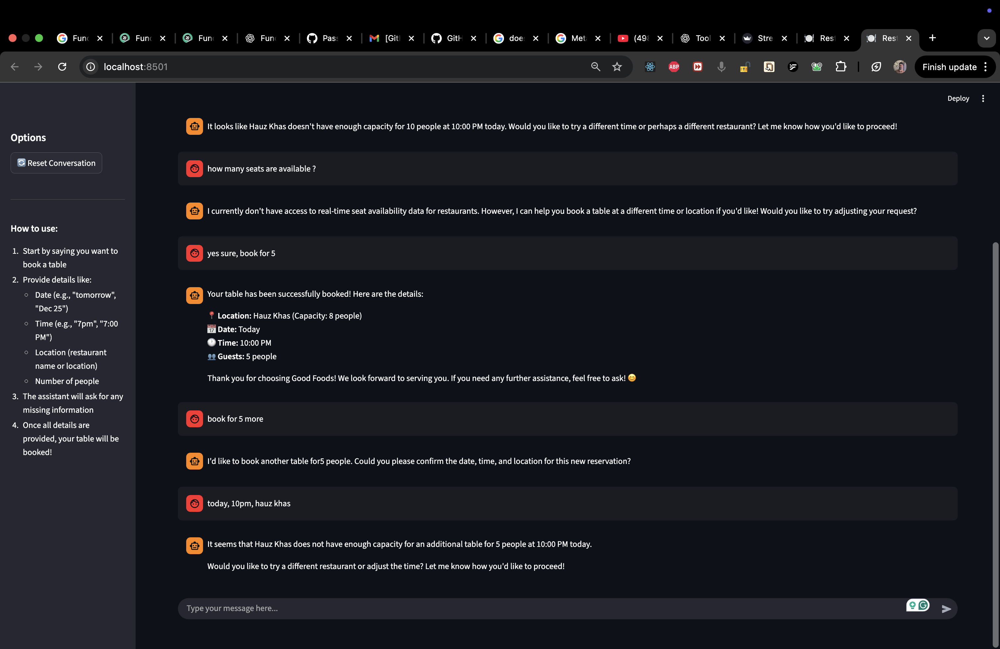

### Reservation system using Locally Hosted, tool Calling SLM  
- Using FunctionGemma , a 270M Model instruction tuned on tool calling.

- This approach uses streamlit 

#### Sample Conversation

**User:** I want to book a table for 4 at Hauz Khas tomorrow at 8pm.  
**Assistant:** Great! Booking a table for 4 at Hauz Khas tomorrow at 8pm.  
**Assistant:** ✅ Your table is confirmed at Hauz Khas for 4 people tomorrow at 8:00 PM.

---

**User:** Can I book for 10 people at Hauz Khas tonight?  
**Assistant:** Sorry, the requested party size exceeds the capacity for Hauz Khas at the selected time.  
**Assistant:** Would you like to try a different location or reduce the number of people?

---

 <u>Booking for hauz khas </u>
 <u>Capacity Exceeded</u>
