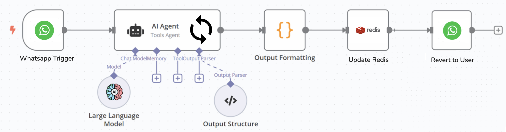
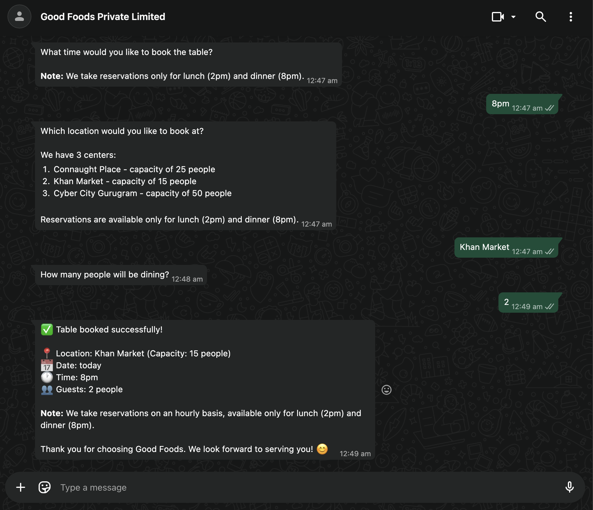
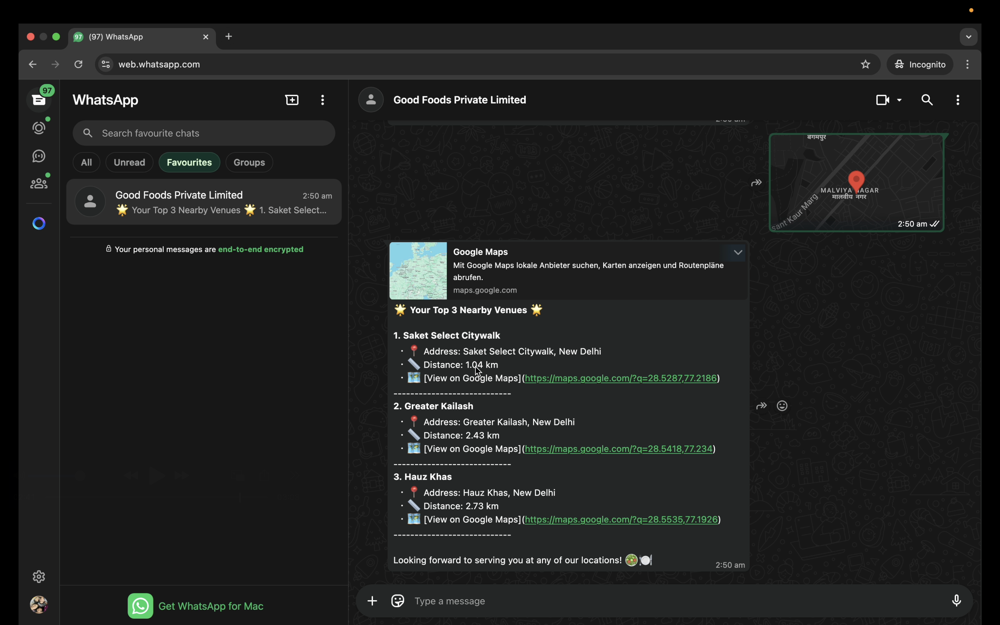

# 🍽️ Restaurant Reservation WhatsApp Agent

A **conversational AI agent** for hassle-free **restaurant table reservations** on WhatsApp, featuring location-based venue recommendations. This project leverages advanced agent orchestration, LLM-powered intent classification, and parameter extraction to create a seamless booking experience.

---

## 🏗️ Architecture Overview

The system uses a **multi-agent orchestration pattern**:

| Component                     | Description                                                         |
|-------------------------------|---------------------------------------------------------------------|
| **Webhook Server**            | (`server.py`)<br>FastAPI endpoint receiving WhatsApp messages via ngrok |
| **MCP Server**                | (`mcp_server/mcp_server.py`)<br>Standalone orchestration on `/classify_intent_and_trigger` (port 8001) |
| **Agent Orchestrator**        | (`mcp_server/agent_orchestrator.py`)<br>Conversation flow & function execution |
| **Intent Classifier Agent**   | (`agents/intent_classify.py`)<br>Classifies user intent (OpenRouter LLM)   |
| **Parameter Extractor Agent** | (`agents/parameter_extractor.py`)<br>Extracts required parameters         |
| **Location Detector Agent**   | (`agents/location_detector.py`)<br>Maps location names to IDs            |
| **Time Extractor Agent**      | (`agents/time_extractor.py`)<br>Normalizes time expressions              |
| **Recommendation System**     | (`recommendation_system/rs.py`)<br>Distance-based venue ranking          |
| **Conversation State**        | (`utils/conversation_state.py`)<br>Redis-backed multi-turn state         |

---
## High Level System Flow Diagram

 <u>HLD Diagram </u>

---

## 🛠️ Tech Stack

- **Framework:** FastAPI
- **LLM:** OpenRouter (Qwen 3 8B)
- **Messaging:** WhatsApp (WHAPI)
- **State:** Redis
- **Tunneling:** ngrok
- **Language:** Python 3.11+

---

## ✨ Key Features

- **🗓️ Table Booking:** Multi-turn dialog to collect date, time, party size, & location
- **📍 Location Recommendations:** Get nearest venues based on WhatsApp location sharing
- **📊 Capacity Management:** Real-time, per-hour availability tracking in Redis
- **💬 Persistent Conversation State:** Robust context handling for interrupted flows
- **⚠️ Graceful Error Handling:** Friendly responses & fallbacks (no LLM confusion leaks!)

---

## 🚀 Quick Start

### 1. Prerequisites

- Python 3.11+
- Redis
- ngrok account
- WHAPI account & token
- OpenRouter API key

---

### 2. Installation

<details>
  <summary>▶️ <b>Step-by-step Setup</b></summary>

1. **Clone the repository**
   ```bash
   git clone https://github.com/hbudhi-iitd/restaurant-reservation-whatsapp-agent
   cd restaurant-reservation-whatsapp-agent
   ```

2. **Create virtual environment**
   ```bash
   python -m venv venv
   source venv/bin/activate  
   ```

3. **Install dependencies**
   ```bash
   pip install -r requirements.txt
   ```

4. **Configure environment variables**
   ```bash
   cp env.example .env
   ```
   Edit `.env`, e.g.:
   ```env
   WHAPI_TOKEN=your_whapi_token
   WHAPI_BASE_URL=https://gate.whapi.cloud
   OPENROUTER_API_KEY=your_openrouter_key
   REDIS_HOST=localhost
   REDIS_PORT=6379
   REDIS_DB=0
   REDIS_PASSWORD=your_redis_password
   ```

5. **Start Redis service**

   Start your local Redis server if it is not already running.  
   Example (for Linux/macOS):
   ```bash
   redis-server
   ```

6. *(Optional)* **Seed Redis with capacity data**  
   This step pre-populates the database with sample table availability.
   ```bash
   python -m utils.populate_redis
   ```
</details>

---

### 3. Running the Server

1. **Start FastAPI webhook server**
   ```bash
   make start-server
   # or:
   uvicorn server:app --reload --port 8000
   ```

2. **Start MCP server** (optional; decoupled orchestration)
   ```bash
   python -m mcp_server.mcp_server
   # or:
   uvicorn mcp_server.mcp_server:app --reload --port 8001
   ```
   > MCP provides `/classify_intent_and_trigger` for direct orchestration.

3. **Expose server via ngrok**
   ```bash
   make ngrok
   # or:
   ngrok http 8000
   ```

4. **Configure WHAPI webhook**
   - Copy the ngrok HTTPS URL (e.g., `https://abc123.ngrok-free.app`)
   - Set `{ngrok_url}/webhook` as the webhook in WHAPI dashboard
   - Enable polling for inbound messages

---

## 🧪 Testing

```bash
# Test webhook endpoint
make test-wapp-api

# Test individual agents
make test-time-extractor-agent
make test-location-detector-agent
make test-booking-utils
```

---

## 🔎 How It Works

<details>
  <summary>▶️ <b>Conversation Lifecycle</b></summary>

1. **Message Reception:** WhatsApp events POSTed to `/webhook` via WHAPI.
2. **Agent Orchestration:** Webhook server forwards input to orchestrator.
3. **Intent Classification:** LLM decides user's desired action, e.g. `book_table`.
4. **Parameter Extraction:** System collects missing info via dialog turns.
5. **State Persistence:** Current intent, collected params, and missing params stored in Redis.
6. **Function Execution:** When all info is present, e.g., make a reservation!
7. **Response:** User notified via WhatsApp through WHAPI.
</details>

> **Note:** MCP server (`mcp_server/mcp_server.py`) is a standalone service for intent+function orchestration. The main webhook (`server.py`) integrates orchestration directly.

---

## 🔗 Webhook & Messaging

- **WHAPI:** REST API for WhatsApp (`/messages/text`, `/messages/location` etc.)
- **ngrok:** Converts local FastAPI port to public HTTPS
- **WHAPI Polling:** Your server receives event polling from WHAPI

---

## 📂 Project Structure

```
wapp_distribution/
├── agents/                  # LLM-powered agents
│   ├── intent_classify.py
│   ├── parameter_extractor.py
│   ├── location_detector.py
│   └── time_extractor.py
├── mcp_server/
│   ├── agent_orchestrator.py  # Core orchestration logic
│   └── mcp_server.py          # FastAPI server (port 8001)
├── recommendation_system/
│   └── rs.py                # Venue recommendations
├── utils/
│   ├── booking_utils.py
│   ├── conversation_state.py
│   ├── whatsapp_utils.py
│   └── openrouter.py
├── server.py                # Webhook endpoint
├── location.json            # Venue data
└── requirements.txt
```

---

## 🎬 Demo

### ▶️ Video Walkthrough

[](https://drive.google.com/file/d/14Vm6DjX-HUQ3ahau3AUY6ju6UKz7Yk_w/view?usp=sharing)

 <u>Reservation Flow</u>

 <u>Recommendation Flow</u>

## Documentation

For detailed documentation and design choices, please check, <u>[Notion Documentation](https://three-conga-1c1.notion.site/Good-Foods-Reservation-System-2cb381648112817eae2fed3a8ca01182)</u>.

## Author

🖊️ <u>[Harshit Budhiraja](https://www.linkedin.com/in/harshit-budhiraja-68b4a8166/)</u>

